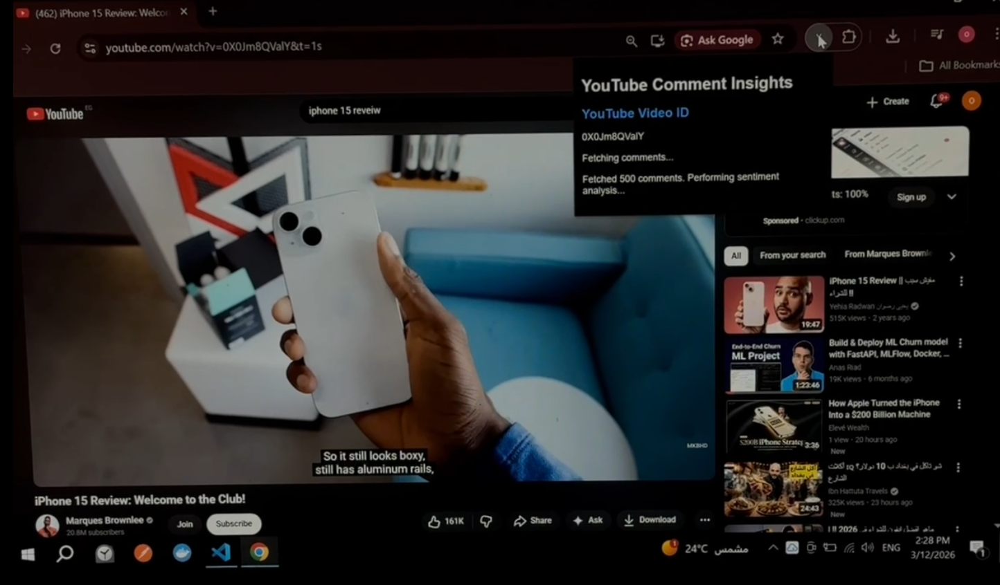

# 🎬 YouTube Sentiment Insights

<p align="center">
  
  
  
  
  
  
  
  
</p>

<p align="center">
  A <strong>production-ready MLOps pipeline</strong> for analyzing sentiment in YouTube comments — complete with a <strong>Chrome Extension</strong> for instant in-browser analysis, a containerized Flask API, DVC-versioned pipeline, and fully automated AWS deployment via GitHub Actions.
</p>

---

## 📌 Table of Contents

- [Overview](#-overview)
- [Demo](#-demo)
- [MLOps Architecture](#-mlops-architecture)
- [Tech Stack](#-tech-stack)
- [Project Structure](#-project-structure)
- [Chrome Extension](#-chrome-extension)
- [ML Pipeline](#-ml-pipeline)
- [API Reference](#-api-reference)
- [CI/CD Pipeline](#-cicd-pipeline)
- [Getting Started](#-getting-started)
- [Results](#-results)

---

## 🔍 Overview

**YouTube Sentiment Insights** is a full end-to-end ML system that classifies YouTube comments as **positive**, **negative**, or **neutral** — and surfaces the results directly inside the browser via a **Chrome Extension**.

The project demonstrates a complete **MLOps workflow**: data versioning with DVC, experiment tracking, model serving with Flask, containerization with Docker, and automated cloud deployment on AWS — all triggered via GitHub Actions CI/CD.

### Key Highlights
- ✅ **LightGBM** classifier with text preprocessing pipeline
- ✅ **Chrome Extension** — analyze any YouTube video without leaving the browser
- ✅ **Flask REST API** for real-time inference
- ✅ **Dockerized** for reproducible, portable deployment
- ✅ **AWS** cloud deployment (EC2 / ECR)
- ✅ **DVC** for data, model, and pipeline versioning
- ✅ **GitHub Actions** for fully automated CI/CD

---
## 🎥 Demo

[](https://youtu.be/vyts7NzzUWk)

---

## 🏗️ MLOps Architecture

```
                        ┌────────────────────────────┐
                        │      Chrome Extension       │
                        │  (yt-chrome-plugin-frontend)│
                        └────────────┬───────────────┘
                                     │ HTTP Request
                                     ▼
┌──────────────────────────────────────────────────────────────────┐
│                          MLOps Pipeline                          │
│                                                                  │
│  ┌──────────┐    ┌──────────┐    ┌───────────┐   ┌──────────┐  │
│  │   Data   │───▶│  Train   │───▶│ Artifacts │──▶│  Flask   │  │
│  │ (DVC)    │    │LightGBM  │    │  /model   │   │   API    │  │
│  └──────────┘    └──────────┘    └───────────┘   └──────────┘  │
│        │               │                               │        │
│  DVC Remote      Experiment                     ┌──────▼─────┐ │
│  Storage         Tracking                       │   Docker   │ │
│  (dvc.lock)      (params.yaml)                  │ Container  │ │
│                                                 └──────┬─────┘ │
│                                    GitHub Actions      │        │
│                                    CI/CD ─────────────▶│        │
│                                                 ┌──────▼─────┐ │
│                                                 │    AWS     │ │
│                                                 │ ECR + EC2  │ │
│                                                 └────────────┘ │
└──────────────────────────────────────────────────────────────────┘
```

---

## 🛠️ Tech Stack

| Category | Tools |
|---|---|
| **ML Model** | LightGBM, Scikit-learn, TF-IDF |
| **NLP & Preprocessing** | NLTK, Regex, Custom Text Pipeline |
| **API Serving** | Flask, Gunicorn, Jinja2 Templates |
| **Frontend / Extension** | Chrome Extension (JS, HTML, CSS) |
| **Containerization** | Docker, `.dockerignore` |
| **Data & Model Versioning** | DVC (`dvc.yaml`, `dvc.lock`, `.dvc/`) |
| **Experiment Config** | `params.yaml` |
| **CI/CD** | GitHub Actions (`.github/workflows/`) |
| **Cloud Deployment** | AWS EC2, AWS ECR |
| **Version Control** | Git, GitHub |
| **Language** | Python 3.10+ |

---

## 📁 Project Structure

```
Youtube-Sentiment-Insights/
│
├── .github/
│   └── workflows/              # GitHub Actions CI/CD pipeline
│
├── .dvc/                       # DVC configuration & cache
├── dvc.yaml                    # DVC pipeline stage definitions
├── dvc.lock                    # Locked pipeline state (reproducibility)
├── params.yaml                 # Model hyperparameters & config
│
├── src/                        # Core ML source code
│   ├── data_ingestion.py
│   ├── data_transformation.py
│   ├── model_trainer.py
│   └── model_evaluation.py
│
├── Note-books/                 # EDA & experimentation notebooks
│
├── artifacts/                  # DVC-tracked model & data artifacts
│   ├── model/
│   └── data/
│
├── flask_api/                  # Flask REST API
│   └── app.py
│
├── templates/                  # Jinja2 HTML templates
│
├── yt-chrome-plugin-frontend/  # 🔌 Chrome Extension source
│   ├── manifest.json
│   ├── popup.html
│   ├── popup.js
│   └── background.js
│
├── confusion_matrix_Test Data.png
├── Dockerfile
├── .dockerignore
├── .dvcignore
├── setup.py
├── requirements.txt
└── README.md
```

---

## 🔌 Chrome Extension

One of the standout features of this project is the **Chrome Extension** — it brings the ML model directly into the browser, letting users analyze the sentiment of any YouTube video's comments without leaving the page.

### How it works
1. User opens any YouTube video
2. Clicks the extension icon in Chrome
3. Extension fetches the video's comments
4. Sends them to the deployed Flask API on AWS
5. Displays a sentiment breakdown (positive / negative / neutral) in the popup

### Install the Extension (Developer Mode)
```
1. Open Chrome and go to chrome://extensions/
2. Enable "Developer mode" (top-right toggle)
3. Click "Load unpacked"
4. Select the yt-chrome-plugin-frontend/ folder
5. Open any YouTube video and click the extension icon 🎉
```

---

## 🔄 ML Pipeline (DVC)

The pipeline is fully defined in `dvc.yaml` for end-to-end reproducibility. Each stage is tracked and cached — only changed stages are re-run.

```yaml
# Pipeline stages defined in dvc.yaml
stages:
  data_ingestion:       # Fetch & store raw YouTube comment data
  data_transformation:  # Clean text, extract TF-IDF features
  model_trainer:        # Train & tune LightGBM classifier
  model_evaluation:     # Compute metrics, save confusion matrix
```

**Reproduce the full pipeline:**
```bash
dvc repro
```

**Run experiments with different hyperparameters:**
```bash
dvc exp run --set-param model.num_leaves=63
dvc exp show
```

**Push/pull data & model artifacts:**
```bash
dvc push   # Upload artifacts to remote storage
dvc pull   # Download tracked artifacts
```

---

## 🌐 API Reference

**Base URL:** `http://<your-server>:5000`

### `POST /predict`

Predict sentiment for a YouTube comment.

**Request:**
```json
{
  "comment": "This video is absolutely amazing, I learned so much!"
}
```

**Response:**
```json
{
  "comment": "This video is absolutely amazing, I learned so much!",
  "sentiment": "positive",
  "confidence": 0.94
}
```

### `GET /health`
```json
{ "status": "healthy", "model": "loaded" }
```

---

## ⚙️ CI/CD Pipeline

Every push to `main` automatically triggers the full deployment pipeline via **GitHub Actions**:

```
Push to main branch
        │
        ▼
┌───────────────────┐
│   1. Run Tests    │  ← Unit & integration tests
└────────┬──────────┘
         │
         ▼
┌───────────────────┐
│  2. Build Docker  │  ← docker build -t sentiment-api .
│      Image        │
└────────┬──────────┘
         │
         ▼
┌───────────────────┐
│  3. Push to ECR   │  ← AWS Elastic Container Registry
└────────┬──────────┘
         │
         ▼
┌───────────────────┐
│  4. Deploy to EC2 │  ← SSH → docker pull → docker run
└───────────────────┘
```

---

## 🚀 Getting Started

### Prerequisites
- Python 3.10+
- Docker
- DVC: `pip install dvc`
- AWS CLI (for cloud deployment)
- Chrome Browser (for the extension)

### 1. Clone the repo
```bash
git clone https://github.com/omarhatem44/Youtube-Sentiment-Insights.git
cd Youtube-Sentiment-Insights
```

### 2. Install dependencies
```bash
pip install -r requirements.txt
```

### 3. Pull data & model artifacts
```bash
dvc pull
```

### 4. Reproduce the ML pipeline
```bash
dvc repro
```

### 5. Run locally with Docker
```bash
docker build -t sentiment-api .
docker run -p 5000:5000 sentiment-api
```

### 6. Test the API
```bash
curl -X POST http://localhost:5000/predict \
  -H "Content-Type: application/json" \
  -d '{"comment": "This is the best tutorial I have ever watched!"}'
```

---

## 📊 Results

| Metric | Score |
|--------|-------|
| **Accuracy** | ~XX% |
| **F1-Score (Macro)** | ~XX% |
| **Precision** | ~XX% |
| **Recall** | ~XX% |

> Confusion matrix saved as `confusion_matrix_Test Data.png`


---

## 🧠 MLOps Skills Demonstrated

| Skill | How It's Applied |
|---|---|
| **Data Versioning** | DVC tracks raw data, features & model artifacts in `artifacts/` |
| **Pipeline Reproducibility** | `dvc repro` re-runs only changed stages defined in `dvc.yaml` |
| **Experiment Tracking** | Hyperparameters managed in `params.yaml`, results logged per run |
| **Model Serving** | Production Flask API with health check endpoint |
| **Containerization** | Dockerfile + `.dockerignore` for consistent dev/prod environment |
| **CI/CD Automation** | GitHub Actions builds, tests, and deploys on every push to `main` |
| **Cloud Deployment** | Docker image pushed to AWS ECR, served live on AWS EC2 |
| **Product Thinking** | Chrome Extension bridges the ML model to a real user-facing product |

---

## 👤 Author

**Omar Hatem**
- 🎓 Computer Science Student — Modern Academy for Computer Science, Cairo
- 💼 ML Engineer | MLOps Enthusiast
- 🔗 [GitHub](https://github.com/omarhatem44) | [LinkedIn](https://linkedin.com/in/your-profile)

---

<p align="center">
  <i>Built end-to-end with production MLOps practices in mind 🚀</i>
</p>


