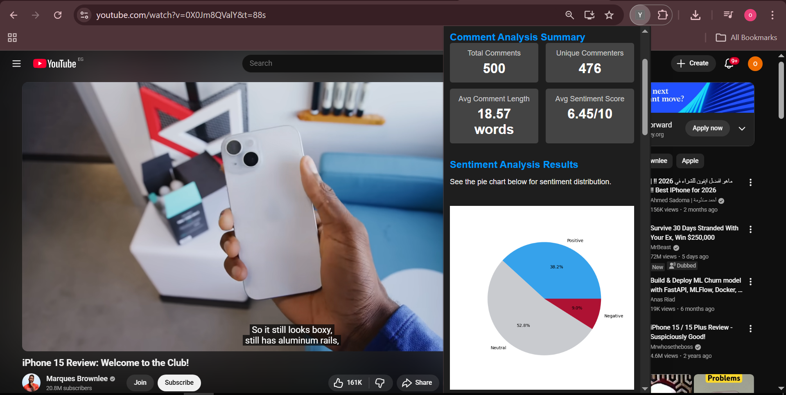
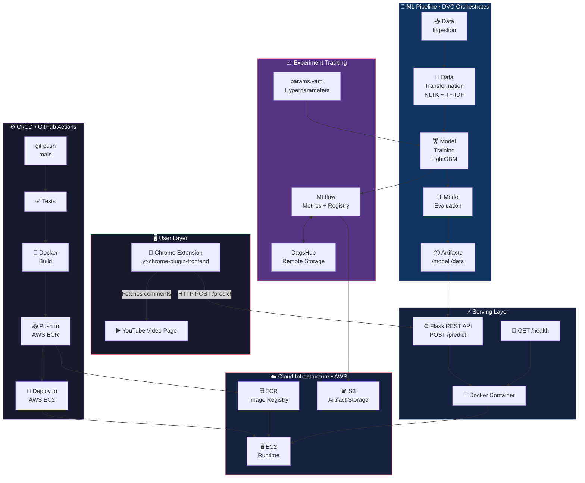
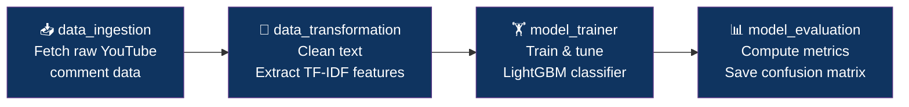
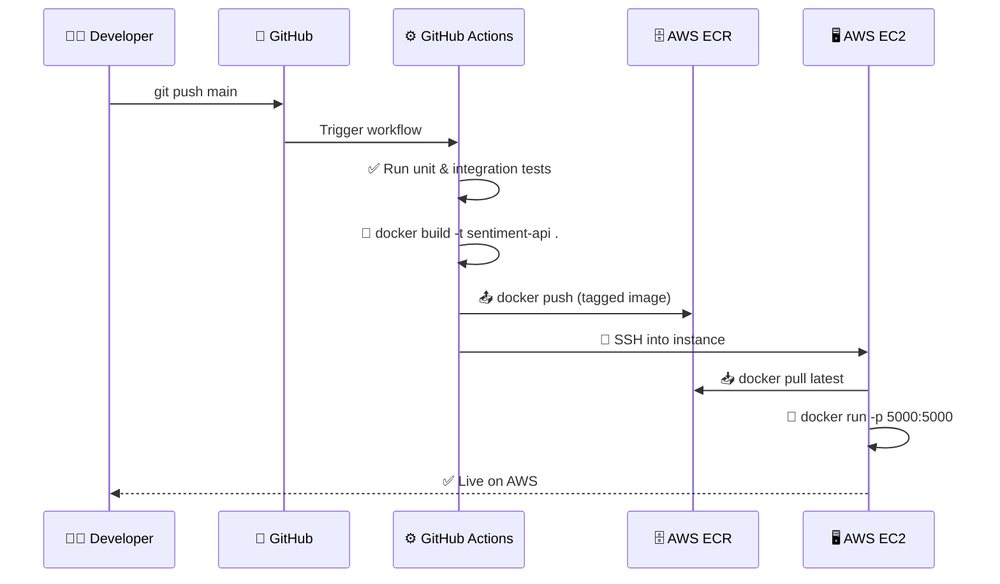
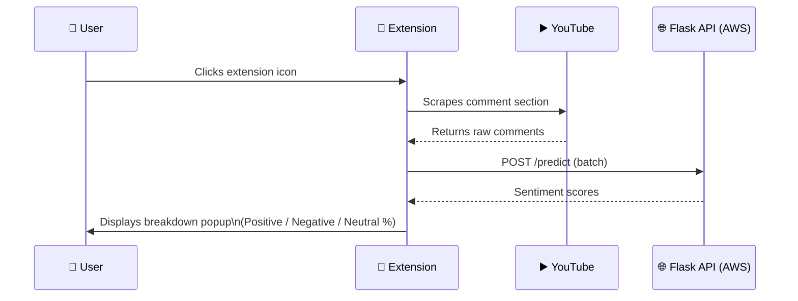

<div align="center">


<br/>

[](https://python.org)
[](https://lightgbm.readthedocs.io)
[](https://flask.palletsprojects.com)
[](https://docker.com)
[](https://aws.amazon.com)
[](https://dvc.org)
[](https://github.com/features/actions)
[](https://mlflow.org)
[](LICENSE)

<br/>

> **A production-grade MLOps system** that classifies YouTube comments as Positive, Negative, or Neutral — surfaced directly inside your browser via a Chrome Extension, backed by a fully automated ML pipeline deployed on AWS.

<br/>

[🚀 Live Demo](#-demo) · [📖 Documentation](#-table-of-contents) · [⚡ Quick Start](#-getting-started) · [🏗️ Architecture](#️-system-architecture)

---

</div>

## 📌 Table of Contents

- [Overview](#-overview)
- [Demo](#-demo)
- [System Architecture](#️-system-architecture)
- [ML Pipeline](#-ml-pipeline-dvc)
- [CI/CD Pipeline](#️-cicd-pipeline)
- [Tech Stack](#-tech-stack)
- [Project Structure](#-project-structure)
- [Chrome Extension](#-chrome-extension)
- [API Reference](#-api-reference)
- [Results](#-results)
- [Getting Started](#-getting-started)
- [MLOps Skills Demonstrated](#-mlops-skills-demonstrated)
- [Author](#-author)

---

## 🔍 Overview

**YouTube Sentiment Insights** is a fully end-to-end ML system designed with production engineering in mind. It analyzes the sentiment of YouTube comment sections and delivers results instantly — without ever leaving your browser.

What makes this project stand apart is the depth of its MLOps foundation: a reproducible DVC pipeline, MLflow experiment tracking, Dockerized serving, and a zero-downtime CI/CD deployment to AWS — all wired together in a cohesive, automated system.

### ✨ Key Highlights

| Feature | Description |
|---|---|
| 🤖 **LightGBM Classifier** | Gradient-boosted model with TF-IDF text features and NLTK preprocessing |
| 🔌 **Chrome Extension** | In-browser sentiment analysis on any YouTube video — no setup needed |
| 🌐 **Flask REST API** | Production-hardened inference endpoint with health check |
| 📦 **Dockerized** | Fully containerized for consistent dev-to-prod parity |
| ☁️ **AWS Deployment** | Auto-deployed to EC2 via ECR on every push to `main` |
| 🔁 **DVC Pipeline** | Versioned, reproducible ML pipeline from raw data to model artifact |
| 📊 **MLflow Tracking** | Experiment metrics and model registry with environment-gated promotion |
| ⚙️ **GitHub Actions CI/CD** | Fully automated build → test → push → deploy workflow |

---

## 🎥 Demo

<div align="center">

[](https://youtu.be/vyts7NzzUWk)

[](https://youtu.be/vyts7NzzUWk)

</div>

---

## 🏗️ System Architecture

The system is composed of four integrated layers: a user-facing Chrome Extension, a production Flask API, an automated MLOps pipeline, and a cloud infrastructure layer on AWS. All stages are orchestrated through GitHub Actions CI/CD.


```mermaid
flowchart TB
    subgraph USER["🖥️  User Layer"]
        EXT["🔌 Chrome Extension\nyt-chrome-plugin-frontend"]
        YT["▶️ YouTube Video Page"]
        EXT -->|"Fetches comments"| YT
    end

    subgraph API["⚡  Serving Layer"]
        FLASK["🌐 Flask REST API\nPOST /predict"]
        HEALTH["💚 GET /health"]
        DOCKER["🐳 Docker Container"]
        FLASK --> DOCKER
        HEALTH --> DOCKER
    end

    subgraph MLOPS["🔁  ML Pipeline  •  DVC Orchestrated"]
        direction LR
        INGEST["📥 Data\nIngestion"]
        TRANSFORM["🔧 Data\nTransformation\nNLTK + TF-IDF"]
        TRAIN["🏋️ Model\nTraining\nLightGBM"]
        EVAL["📊 Model\nEvaluation"]
        ARTIFACTS["📦 Artifacts\n/model  /data"]

        INGEST --> TRANSFORM --> TRAIN --> EVAL --> ARTIFACTS
    end

    subgraph TRACKING["📈  Experiment Tracking"]
        MLFLOW["MLflow\nMetrics + Registry"]
        DAGSHUB["DagsHub\nRemote Storage"]
        PARAMS["params.yaml\nHyperparameters"]
        MLFLOW <--> DAGSHUB
        PARAMS --> TRAIN
        TRAIN --> MLFLOW
    end

    subgraph CICD["⚙️  CI/CD  •  GitHub Actions"]
        direction LR
        PUSH["git push\nmain"]
        TEST["✅ Tests"]
        BUILD["🔨 Docker\nBuild"]
        ECR["📤 Push to\nAWS ECR"]
        DEPLOY["🚀 Deploy to\nAWS EC2"]
        PUSH --> TEST --> BUILD --> ECR --> DEPLOY
    end

    subgraph CLOUD["☁️  Cloud Infrastructure  •  AWS"]
        EC2["🖥️ EC2\nRuntime"]
        ECREG["🗄️ ECR\nImage Registry"]
        S3["🪣 S3\nArtifact Storage"]
        DEPLOY --> EC2
        ECR --> ECREG --> EC2
        MLFLOW --> S3
    end

    EXT -->|"HTTP POST /predict"| FLASK
    ARTIFACTS --> FLASK
    DOCKER --> EC2

    style USER fill:#1a1a2e,stroke:#e94560,color:#fff
    style API fill:#16213e,stroke:#0f3460,color:#fff
    style MLOPS fill:#0f3460,stroke:#533483,color:#fff
    style TRACKING fill:#533483,stroke:#e94560,color:#fff
    style CICD fill:#1a1a2e,stroke:#533483,color:#fff
    style CLOUD fill:#16213e,stroke:#e94560,color:#fff
```

---

## 🔄 ML Pipeline (DVC)

The pipeline is fully defined in `dvc.yaml` and ensures end-to-end reproducibility. Only stages with changed dependencies are re-executed — making iteration fast and deterministic.


```mermaid
graph LR
    A["📥 data_ingestion\nFetch raw YouTube\ncomment data"] -->
    B["🔧 data_transformation\nClean text\nExtract TF-IDF features"] -->
    C["🏋️ model_trainer\nTrain & tune\nLightGBM classifier"] -->
    D["📊 model_evaluation\nCompute metrics\nSave confusion matrix"]

    style A fill:#0f3460,stroke:#533483,color:#fff
    style B fill:#0f3460,stroke:#533483,color:#fff
    style C fill:#0f3460,stroke:#533483,color:#fff
    style D fill:#0f3460,stroke:#533483,color:#fff
```

```bash
# Reproduce the full pipeline
dvc repro

# Run an experiment with custom hyperparameters
dvc exp run --set-param model.num_leaves=63
dvc exp show

# Sync artifacts with remote storage
dvc push   # Upload
dvc pull   # Download
```

---

## ⚙️ CI/CD Pipeline

Every push to `main` triggers the full deployment pipeline with zero manual intervention.


```mermaid
sequenceDiagram
    participant DEV as 👨‍💻 Developer
    participant GH as 🐙 GitHub
    participant GA as ⚙️ GitHub Actions
    participant ECR as 🗄️ AWS ECR
    participant EC2 as 🖥️ AWS EC2

    DEV->>GH: git push main
    GH->>GA: Trigger workflow
    GA->>GA: ✅ Run unit & integration tests
    GA->>GA: 🔨 docker build -t sentiment-api .
    GA->>ECR: 📤 docker push (tagged image)
    GA->>EC2: 🔐 SSH into instance
    EC2->>ECR: 📥 docker pull latest
    EC2->>EC2: 🚀 docker run -p 5000:5000
    EC2-->>DEV: ✅ Live on AWS
```

---

## 🛠️ Tech Stack

<div align="center">

| Layer | Technology |
|---|---|
| **ML Model** | LightGBM, Scikit-learn, TF-IDF Vectorizer |
| **NLP & Preprocessing** | NLTK, Regex, Custom Text Pipeline |
| **Experiment Tracking** | MLflow, DagsHub, AWS S3 (artifact store) |
| **Data & Model Versioning** | DVC (`dvc.yaml`, `dvc.lock`) |
| **API Serving** | Flask, Gunicorn, Jinja2 Templates |
| **Browser Extension** | Chrome Extension (Manifest V3, JS, HTML, CSS) |
| **Containerization** | Docker, `.dockerignore` |
| **CI/CD** | GitHub Actions |
| **Cloud** | AWS EC2 (compute), AWS ECR (image registry), AWS S3 (storage) |
| **Language** | Python 3.10+ |

</div>

---

## 📁 Project Structure

```
End-to-End-MLOps-System-for-Real-Time-YouTube-Sentiment-Analysis/
│
├── .github/
│   └── workflows/                  # GitHub Actions CI/CD pipeline definitions
│
├── .dvc/                           # DVC configuration & cache metadata
├── dvc.yaml                        # Pipeline stage definitions
├── dvc.lock                        # Locked pipeline state (reproducibility)
├── params.yaml                     # Model hyperparameters & experiment config
│
├── src/                            # Core ML source code
│   ├── data_ingestion.py           # Raw data fetching & storage
│   ├── data_transformation.py      # Text cleaning, TF-IDF feature extraction
│   ├── model_trainer.py            # LightGBM training with Optuna tuning
│   └── model_evaluation.py        # Metrics, confusion matrix, model logging
│
├── Note-books/                     # EDA & prototyping notebooks
│
├── artifacts/                      # DVC-tracked model & data artifacts
│   ├── model/                      # Serialized LightGBM model + vectorizer
│   └── data/                       # Versioned raw & processed datasets
│
├── flask_api/
│   └── app.py                      # Production Flask REST API
│
├── templates/                      # Jinja2 HTML templates for web UI
│
├── yt-chrome-plugin-frontend/      # 🔌 Chrome Extension source
│   ├── manifest.json               # Extension manifest (Manifest V3)
│   ├── popup.html                  # Extension popup UI
│   ├── popup.js                    # Frontend logic & API calls
│   └── background.js              # Service worker
│
├── confusion_matrix_Test Data.png  # Model evaluation visualization
├── demo.png                        # Project demo screenshot
├── Dockerfile                      # Container build instructions
├── .dockerignore
├── .dvcignore
├── setup.py
├── requirements.txt
└── README.md
```

---

## 🔌 Chrome Extension

The Chrome Extension is the user-facing product layer of this MLOps system — it brings the deployed ML model directly into the browser with zero friction.

### How It Works


```mermaid
sequenceDiagram
    participant USER as 👤 User
    participant EXT as 🔌 Extension
    participant YT as ▶️ YouTube
    participant API as 🌐 Flask API (AWS)

    USER->>EXT: Clicks extension icon
    EXT->>YT: Scrapes comment section
    YT-->>EXT: Returns raw comments
    EXT->>API: POST /predict (batch)
    API-->>EXT: Sentiment scores
    EXT->>USER: Displays breakdown popup\n(Positive / Negative / Neutral %)
```

### Install in Developer Mode

```bash
1. Open Chrome → chrome://extensions/
2. Toggle "Developer mode" ON (top-right)
3. Click "Load unpacked"
4. Select the yt-chrome-plugin-frontend/ folder
5. Open any YouTube video and click the extension icon 🎉
```

---

## 🌐 API Reference

**Base URL:** `http://<your-ec2-host>:5000`

### `POST /predict`

Classify the sentiment of a YouTube comment.

**Request Body:**
```json
{
  "comment": "This video is absolutely amazing, I learned so much!"
}
```

**Response:**
```json
{
  "comment": "This video is absolutely amazing, I learned so much!",
  "sentiment": "positive",
  "confidence": 0.94
}
```

**Sentiment Labels:** `positive` · `negative` · `neutral`

---

### `GET /health`

Service health check for monitoring and load balancer probes.

**Response:**
```json
{
  "status": "healthy",
  "model": "loaded"
}
```

---

## 📊 Results

<div align="center">

| Metric | Score |
|---|---|
| **Accuracy** | *See evaluation run* |
| **F1-Score (Macro)** | *See evaluation run* |
| **Precision** | *See evaluation run* |
| **Recall** | *See evaluation run* |

<br/>

**Confusion Matrix — Test Set**


</div>

> 📈 Full experiment metrics, parameter sweeps, and run comparisons are tracked in **MLflow on DagsHub**.

---

## 🚀 Getting Started

### Prerequisites

```
Python 3.10+  |  Docker  |  DVC  |  AWS CLI  |  Chrome Browser
```

```bash
pip install dvc mlflow
```

### 1. Clone the Repository

```bash
git clone https://github.com/omarhatem44/End-to-End-MLOps-System-for-Real-Time-YouTube-Sentiment-Analysis.git
cd End-to-End-MLOps-System-for-Real-Time-YouTube-Sentiment-Analysis
```

### 2. Install Dependencies

```bash
pip install -r requirements.txt
```

### 3. Pull Versioned Artifacts

```bash
dvc pull
```

### 4. Reproduce the ML Pipeline

```bash
dvc repro
```

### 5. Run Locally with Docker

```bash
docker build -t sentiment-api .
docker run -p 5000:5000 sentiment-api
```

### 6. Test the API

```bash
curl -X POST http://localhost:5000/predict \
  -H "Content-Type: application/json" \
  -d '{"comment": "This is the best tutorial I have ever watched!"}'
```

---

## 🧠 MLOps Skills Demonstrated

<div align="center">

| MLOps Pillar | Implementation |
|---|---|
| **Data Versioning** | DVC tracks raw data, features, and model artifacts under `artifacts/` |
| **Pipeline Reproducibility** | `dvc repro` re-executes only changed stages from `dvc.yaml` |
| **Experiment Tracking** | MLflow logs metrics, params, and models; DagsHub as remote backend |
| **Model Registry** | MLflow Model Registry with environment-gated staging → production promotion |
| **Model Serving** | Production Flask API with `/predict` and `/health` endpoints |
| **Containerization** | Dockerfile + `.dockerignore` for consistent dev/prod environment parity |
| **CI/CD Automation** | GitHub Actions auto-builds, tests, and deploys on every push to `main` |
| **Cloud Deployment** | Docker image pushed to AWS ECR, served live on AWS EC2 |
| **Artifact Storage** | AWS S3 bucket (`s3://mlflow-bucket-one`) as MLflow artifact store |
| **Product Thinking** | Chrome Extension bridges the ML model to a real user-facing product |

</div>

---

## 👤 Author

<div align="center">

**Omar Hatem**

🎓 Computer Science Student — Modern Academy for Computer Science, Cairo, Egypt
💼 ML Engineer · MLOps Enthusiast · Production Systems Builder

[](https://github.com/omarhatem44)
[](https://linkedin.com/in/omar-hatem-44)

</div>

---

<div align="center">

*Built end-to-end with production MLOps practices — from raw data to browser extension, fully automated on AWS* 🚀

⭐ **Star this repo** if you found it useful — it helps others discover it!

</div>
